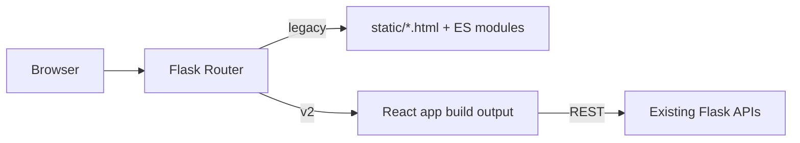

# UI Modernization Plan - Phase 2 (Reconciled)

Date: 2026-02-22  
Status: Phase 0 complete, decision gate ready  
Owner: Pi-Health maintainers

Phase 0 signoff artifact: `Docs/UI_PHASE0_RELEASE_SIGNOFF.md`

## 1. Project Overview

### Vision
Deliver a modern, clean, mobile-first Pi-Health UI where all management workflows are fully usable on phone, tablet, and desktop without requiring a PC.

### Trigger
The immediate trigger is active user complaints about broken mobile UX.

### Strategic Correction Applied
This plan now separates:

1. Immediate mobile pain relief in current architecture (Phase 0).
2. Optional longer-horizon React/shadcn migration (Phases 1+), gated by Phase 0 outcomes.

### Success Metrics

1. Critical routes (`containers`, `system`) have no horizontal viewport overflow at 390x844.
2. Navigation is touch-accessible without hover.
3. All critical actions on `containers` are reachable on phone/tablet.
4. Playwright includes desktop + phone + tablet profiles for smoke coverage.
5. No backend API behavior regressions.

## 2. Current State Baseline (As-Is)

The codebase is not starting from zero modernization. Current baseline:

1. Route/page modernization completed across active pages (`static/js/pages/*`).
2. Shared frontend utilities exist (`static/js/lib/layout.js`, `static/js/lib/auth.js`, `static/js/lib/http.js`, `static/js/lib/states.js`, `static/js/lib/notify.js`).
3. Shared design token layer exists (`static/css/foundation.css`).
4. Existing theme system is active with multiple theme variants and user expectations.
5. Main unresolved gaps are mobile-specific:
   - Desktop-first nav interaction model in `static/js/nav.js`.
   - Notification placement and width assumptions on small viewports.
   - Table/data density overflow patterns (`containers`, `disks` hotspots).

## 3. Scope

### In Scope

1. Ship a standalone Phase 0 mobile hotfix in current stack this week.
2. Add mobile/tablet regression coverage immediately (Phase 0), not deferred.
3. Re-evaluate if React/shadcn migration is still required after Phase 0.
4. If required, migrate incrementally with page-level rollout controls.

### Out of Scope

1. Backend API redesign.
2. Storage/plugin domain model redesign.
3. New product features unrelated to mobile usability/parity.

## 4. Decision Gate

After Phase 0 completion, run a formal decision checkpoint:

1. If user complaints are materially resolved, continue on current stack and treat React migration as a separate RFC/timeline.
2. If major constraints remain, proceed with Phases 1+ (React/shadcn path).

This gate is mandatory to avoid conflating urgent bug-fix scope with multi-month rewrite scope.

## 5. Technical Decisions

### 5.1 Phase 0 Stack (Immediate)

Use existing architecture:

1. Flask-served static HTML routes.
2. Existing ES modules and shared libs.
3. Existing theme system.

### 5.2 Phase 1+ Stack (Conditional)

If decision gate approves React migration:

| Layer | Technology | Pin | Rationale |
|---|---|---|---|
| Frontend runtime | React | 18.x | Mature ecosystem |
| Language | TypeScript | 5.x | Refactor safety |
| Build tool | Vite | 5.x+ | Fast builds/dev loop |
| Styling | Tailwind CSS | 4.x (pinned) | Modern model and shadcn compatibility |
| Components | shadcn/ui patterns | generated at lockfile version | Consistent, clean primitives |
| Data fetching | TanStack Query | 5.x | Server-state ergonomics |
| Validation | Zod | 3.x | Runtime payload safety |

### 5.3 Performance Budgets (Phase 1+)

1. Initial JS (critical route) <= 200 KB gzip.
2. Initial CSS <= 80 KB gzip.
3. Route chunk addition <= 100 KB gzip per major feature route.
4. Lighthouse mobile performance target >= 85 on Pi-hosted LAN baseline.

## 6. Theme Strategy

### Current Default Policy

1. Preserve current default visual expectation: modern dark baseline.
2. Do not change deployed default appearance abruptly.

### V2 Policy

1. Start v2 with one unified modern theme + `dark/light/system` mode switch.
2. Keep legacy theme variants functional on legacy routes during migration.
3. Port additional legacy theme variants to v2 later as explicit follow-up scope.

## 7. Architecture and Integration (Phase 1+)

### High-Level

### Flask/Vite Integration Scope (Explicit)

If Phase 1+ starts, these tasks are required before page migration:

1. Build output target: `frontend/dist`.
2. Publish build artifacts into `static/v2/` at build/release time.
3. Add Flask routes in `app.py`:
   - `/v2`
   - `/v2/<path:path>` (serve asset if exists, else `index.html` for SPA routing)
4. Implement page-level route switch using env config:
   - `PIHEALTH_UI_MODE=legacy|hybrid|v2`
   - `PIHEALTH_UI_V2_PAGES=containers,stacks,disks`
5. In `hybrid` mode, legacy route handlers redirect only selected pages to `/v2/<page>`.

## 8. Implementation Phases

### Phase 0: Mobile Triage (Standalone, Immediate, 3-5 days)

Goal: Resolve the active complaint using current stack.

Execution ticket set: `Docs/UI_PHASE0_HOTFIX_TICKETS.md`

#### Phase 0 Work Items (File-Level)

| Area | Files | Required change |
|---|---|---|
| Touch-first nav | `static/js/nav.js` | Replace hover-only dropdown dependency with mobile menu + tap interactions |
| Nav responsive style | `static/js/nav.js` (injected styles) and/or `static/css/foundation.css` | Add breakpoints for collapsed nav and wrapped action region |
| Toast placement | `static/js/lib/layout.js`, `static/js/lib/notify.js`, `static/js/api.js` | Move to mobile-safe positioning/sizing (`bottom-center` or full-width constrained) |
| Containers overflow | `static/containers.html`, `static/css/containers.css`, `static/js/pages/containers.js` | Add responsive table container and mobile card/list rendering path |
| Disks overflow hotspot | `static/js/pages/disks.js`, `static/css/disks.css` | Ensure internal table/output sections do not exceed viewport |
| Global spacing | `static/*.html` common shell spacing classes | Replace desktop-only spacing with responsive spacing classes |

#### Phase 0 Test Tasks

1. Extend Playwright viewport profiles in `tests/e2e/conftest.py`:
   - Desktop (1280x720)
   - Phone (390x844)
   - Tablet (768x1024)
2. Add reusable overflow assertion:
   - `document.documentElement.scrollWidth <= window.innerWidth`
3. Add mobile smoke coverage for:
   - Login
   - System
   - Containers (including action access and modal open/close)

#### Phase 0 Exit Criteria (Testable)

1. `containers` and `system` render without horizontal scroll at 390x844.
2. Primary nav is fully reachable without hover on phone/tablet.
3. Container actions (start/stop/restart/logs/network test) are reachable on phone.
4. Updated mobile smoke tests pass in CI/local test run.

### Phase 1: Foundation (Conditional, 1-2 weeks)

Precondition: Decision gate approves React migration.

1. Scaffold `frontend/` app.
2. Implement shell primitives and auth guard.
3. Complete Flask/v2 integration and hybrid routing.
4. Enforce bundle budgets in CI.

Milestone: `/v2` shell + auth + one protected placeholder route working under Flask.

### Phase 2: Pilot Vertical Slice (Conditional, 1-2 weeks)

1. Migrate `containers` first.
2. Preserve full parity: polling, logs, network diagnostics, actions.
3. Validate phone/tablet touch UX and overflow constraints.

Milestone: `containers` parity in desktop + phone + tablet.

### Phase 3: Core Management Pages (Conditional, 3-5 weeks)

1. Migrate: `stacks`, `disks`, `pools`, `mounts`, `shares`, `plugins`, `settings`.
2. Reuse pilot primitives to minimize divergence.
3. Keep page-level fallback enabled until each route is accepted.

### Phase 4: Remaining Pages and Cutover (Conditional, 2-3 weeks)

1. Migrate: `apps`, `system`, `network`, `tailscale`, `tools`, `index`.
2. Make v2 default after acceptance gates.
3. Keep legacy fallback for one stabilization cycle.

## 9. Test and Quality Plan

### Automated

1. Desktop + phone + tablet Playwright profiles.
2. Overflow assertions on target routes.
3. Critical workflow assertions on mobile for top routes.
4. Existing unit/API tests remain required gate.

### Manual Smoke Checklist

1. Login/logout/session timeout.
2. Container lifecycle + logs + network test.
3. System actions and status visibility.
4. Disk and plugin high-risk workflows.
5. Theme/mode switching and readability.

## 10. Rollout and Rollback

### Rollout

1. Ship Phase 0 as immediate standalone release.
2. Collect user feedback and support signal for 3-7 days.
3. Trigger Decision Gate.
4. If approved, proceed with hybrid v2 rollout route-by-route.

### Rollback

1. For Phase 0: revert specific hotfix commits/files if regression occurs.
2. For Phase 1+: use `PIHEALTH_UI_MODE` and `PIHEALTH_UI_V2_PAGES` to disable v2 route exposure instantly.

## 11. Risks and Mitigations

| Risk | Impact | Mitigation |
|---|---|---|
| Conflating hotfix and rewrite scope | Delayed relief | Mandatory Decision Gate after Phase 0 |
| Missing Flask v2 integration tasks | Phase 1 blocked | Explicit route/build integration scope in Phase 1 |
| Theme expectation mismatch | User confusion | Preserve modern dark default; stage variant migration |
| Bundle growth on Pi hardware | Slow UX | Hard bundle budgets + CI checks |
| Mobile regressions recur | User churn | Mobile Playwright profiles in Phase 0 |

## 12. Exit Criteria

Plan success requires:

1. Phase 0 shipping with measurable mobile improvements.
2. Decision Gate completed and documented.
3. If Phases 1+ proceed, parity and rollout safeguards maintained.

## 13. Review Outcomes (Current)

Decisions adopted for this plan revision:

1. `containers` approved as first migration pilot (if Phase 1+ proceeds).
2. Preserve current default visual baseline (modern dark continuity).
3. Start v2 with one unified modern theme and add legacy variants later.
4. Page-level feature flags approved with explicit Flask implementation scope.
5. Phase 0 treated as standalone deliverable and first priority.
